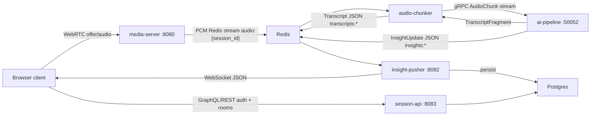

# Resonance

Resonance is an adaptive live audio intelligence platform. The local MVP runs a browser audio session through an `aiortc` media server, taps server-side PCM, streams 3-second chunks to a gRPC AI pipeline, and pushes live transcripts and insights back to the browser over WebSockets.

This MVP uses DTLS-SRTP transport encryption between each browser and the media server. It is not true end-to-end encryption: the server terminates media encryption and can decode audio for the tap path.

## Architecture



## Services

- `media-server`: FastAPI + aiortc WebRTC signaling (WebSocket + trickle ICE) and server-side PCM tap into Redis streams.
- `audio-chunker`: Redis consumer-group worker that sends `AudioChunk` messages to the AI gRPC service.
- `ai-pipeline`: gRPC server with faster-whisper transcription and `mock|anthropic|openai` analyzer adapters.
- `insight-pusher`: authenticated WebSocket fan-out for `insights:*` and `transcripts:*`, with Postgres persistence.
- `session-api`: FastAPI + Strawberry GraphQL auth, room management, and historical queries.
- `client`: static browser demo for account, room, microphone, transcript, summary, action items, and sentiment.

## Local Setup

1. Copy `.env.example` to `.env` and set at least `JWT_SECRET`.
2. Start the backend stack:

```bash
docker compose -f infra/docker-compose.yml up --build
```

3. Start the browser demo as well:

```bash
docker compose -f infra/docker-compose.yml --profile demo up --build
```

4. Open `http://localhost:8088`.
5. Register or log in, create a room, start audio, then open a second browser window and join with the invite token.

For a lightweight local demo without an LLM key, keep `LLM_PROVIDER=mock`. For a faster no-model smoke test, set `WHISPER_MODEL=mock`; for the intended transcription path, use `WHISPER_MODEL=base.en` or `small.en`.

## Environment

- `REDIS_URL`: Redis connection string.
- `POSTGRES_DSN`: Postgres connection string.
- `JWT_SECRET`: shared HMAC secret for Session API, media server, and WebSocket auth.
- `WHISPER_MODEL`: `base.en`, `small.en`, or `mock`.
- `LLM_PROVIDER`: `mock`, `anthropic`, or `openai`.
- `ANTHROPIC_API_KEY`: required when `LLM_PROVIDER=anthropic`.
- `OPENAI_API_KEY`: required when `LLM_PROVIDER=openai`.
- `TURN_SERVER_URL`, `TURN_USERNAME`, `TURN_CREDENTIAL`: optional ICE config for WebRTC NAT traversal (comma-separated `stun:`/`turn:` URLs). This is shared by the media server and the demo client.
- `AUDIO_STREAM_MAXLEN`: maximum entries retained per `audio:{session_id}` Redis stream (approximate trim).
- `AUDIO_CLAIM_IDLE_MS`, `AUDIO_CLAIM_BATCH`: Redis Stream pending-entry reclaim settings for the audio chunker.

## Development

```bash
make proto
make lint
make test
make up-demo
```

If you don't have local Python dependencies installed (for example `ruff` or `bcrypt`), you can run the same checks via Docker:

```bash
make lint-docker
make test-docker
```

The shared gRPC contract lives in `proto/resonance.proto`. Docker images compile the proto into the services that need generated Python modules.

## GitLab CI/CD

This repo uses `.gitlab-ci.yml`, not GitHub Actions. The pipeline stages are:

- `lint`: Ruff over `services`.
- `test`: pytest over service tests with Redis and Postgres service containers available.
- `proto`: validates the gRPC proto compiles.
- `build`: builds and pushes service images to the GitLab Container Registry.
- `deploy`: manual placeholder until a deployment target is chosen.

Images are pushed as `$CI_REGISTRY_IMAGE/<service>:$CI_COMMIT_SHA`; `latest` is pushed only from the default branch.

## Demo Acceptance Path

1. Register user A in one browser.
2. Create a room and copy the invite token.
3. Register or log in as user B in another browser.
4. Join the room with the invite token.
5. Start audio in each browser.
6. Confirm Redis receives `audio:{session_id}` entries.
7. Confirm transcripts appear in the transcript panel.
8. Confirm summaries, action items, and sentiment update through the WebSocket panel.

## Security Notes

- The media server has access to decoded audio by design.
- JWT auth is shared by services for MVP simplicity; use key rotation and tighter service boundaries before production.
- CORS is open for local development and should be restricted for any deployed environment.
- TURN credentials should be short-lived in production.
